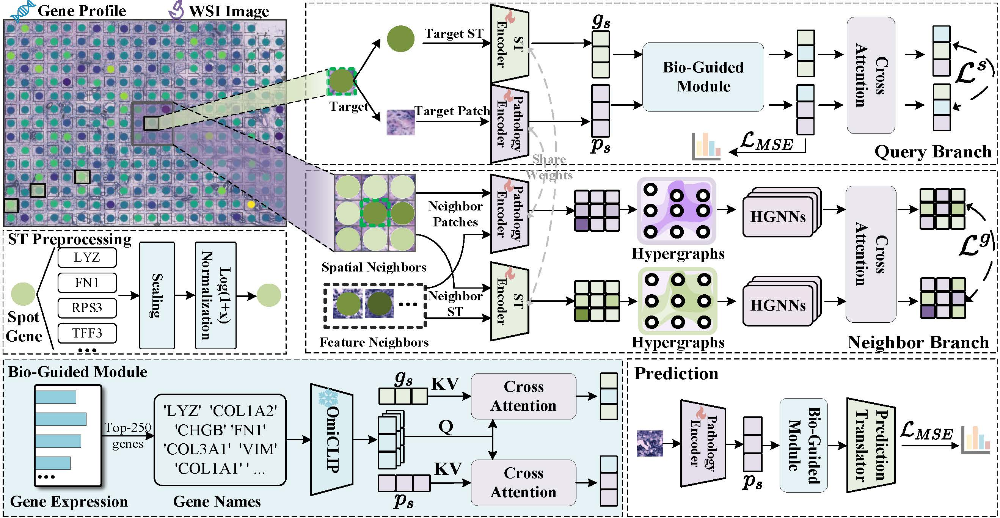

# STAG: Biologically Guided Spatial Transcriptomics Prediction via Hypergraph Learning

STAG predicts spatial gene expression from histopathology images. This
repository contains two training pipelines:

- `2D/`: single-section spot-level prediction from H&E image patches.
- `3D/`: pseudo-3D prediction from preprocessed serial-section graph data.

For implementation details, see [`2D/README.md`](2D/README.md),
[`3D/README.md`](3D/README.md), and [`DOCS.md`](DOCS.md).



## Framework Overview

STAG consists of two key components: a **Query branch** and a **Neighbor
branch**. In the 2D setting, the Query branch processes the target pathology
patch and its paired spatial transcriptomics spot, while the Neighbor branch
takes neighboring regions as input. Intra-slice relationships are modeled with
hypergraphs. The two branches further use cross-attention and contrastive
learning losses (`L_s` and `L_g`) to refine and align cross-modal features
between histology and gene expression.

During inference, only the pathology encoder is used, so STAG predicts gene
expression directly from the histology image.

## Contents

1. [Pipeline Overview](#pipeline-overview)
2. [Installation](#installation)
3. [2D Pipeline](#2d-pipeline)
4. [3D Pipeline](#3d-pipeline)
5. [Outputs](#outputs)
6. [Data Download](#data-download)
7. [Citation](#citation)

## Pipeline Overview

| Pipeline | Purpose | Entry point |
|:--|:--|:--|
| **2D STAG** | Single-section gene-expression prediction | [`2D/train_STAG.py`](2D/train_STAG.py) |
| **2D STAG, no text** | Ablation without gene-text embeddings | [`2D/train_STAG_notext.py`](2D/train_STAG_notext.py) |
| **2D STAG, HVG** | Prediction on highly variable gene panels | [`2D/train_STAG_hvg.py`](2D/train_STAG_hvg.py) |
| **3D STAG** | Pseudo-3D prediction with serial-section context | [`3D/main.py`](3D/main.py) |

By default, training saves metrics and fold splits only. Checkpoints,
TensorBoard files, and full stdout logs are optional flags.

## Installation

Install dependencies inside the pipeline folder you want to run.

```bash
# 2D experiments
cd 2D
pip install -r requirements.txt

# 3D experiments
cd ../3D
pip install -r requirements.txt
```

The image encoder uses a self-supervised ResNet18 checkpoint at
`weights/tenpercent_resnet18.ckpt`. If the file is missing, the code attempts to
download it on the first run.

## 2D Pipeline

### 2D Data Structure

Place all 2D datasets under `2D/data/`.

```text
2D/data/
|-- GSE144240/                                               # cSCC
|-- HER2/                                                    # HER2ST
|-- Human_breast_cancer_in_situ_capturing_transcriptomics/  # HBC
`-- Hest1k_datasets/                                         # HEST-1k subsets
```

Expected files for each dataset:

```text
GSE144240/
|-- *.jpg
|-- *_stdata.tsv
`-- *_spot_data-selection-P*.tsv

HER2/
|-- images/HE/*.jpg
|-- count-matrices/*.tsv
`-- spot-selection/*_selection.tsv

Human_breast_cancer_in_situ_capturing_transcriptomics/
|-- *.jpg
|-- *_stdata.tsv
`-- spots_*.csv

Hest1k_datasets/<subset>/
|-- st/*.h5ad
`-- wsis/*.tif
```

Gene panels and gene-text embeddings are loaded from `2D/select_genes/`.

### 2D Datasets

The following settings are configured for the text-guided
[`train_STAG.py`](2D/train_STAG.py) entry point.

| Dataset | `--data_name` | Folds | Epochs | Batch |
|:--|:--|--:|--:|--:|
| **cSCC** | `cSCC` | 4 | 50 | 8 |
| **HER2ST** | `HER2` | 6 | 50 | 8 |
| **HBC** | `HBC` | 9 | 50 | 8 |
| **HEST kidney** | `HEST_kidney` | 6 | 50 | 8 |
| **HEST mouse brain** | `HEST_mouse_brain` | 5 | 50 | 8 |
| **HEST PRAD** | `HEST_PRAD` | 6 | 50 | 8 |
| HEST LUAD | `HEST_LUAD` | - | - | - |

Processed archives for the available datasets are listed in
[Data Download](#data-download). HEST LUAD is retained as an optional extension
and is not part of the processed-data release.

Gene panels and gene-text embeddings are already included under
`2D/select_genes/`.

The parser also contains names such as `HEST_IDC`, `HEST_PAAD`, `HEST_SKCM`,
`HEST_her2st`, `HEST_Liver`, and `HEST_Lung`. Before running the text-guided
main model on those datasets, add the corresponding entries to `GENE_FILES` and
`TEXT_FILES` in `2D/train_STAG.py`.

### 2D Splits

All 2D splits are sample-level splits. Spots from the same WSI/sample are never
split across train and validation folds.

All splits use `KFold(..., shuffle=True, random_state=1553)`.

| Dataset family | Split unit | Ordered input |
|:--|:--|:--|
| **cSCC** | WSI | Sorted `.jpg` files in `GSE144240/` |
| **HER2ST** | WSI | Sorted `.jpg` files in `HER2/images/HE/` |
| **HBC** | WSI | Sorted `.jpg` files in the HBC directory |
| **HEST-1k** | Sample ID | Sorted `st/*.h5ad` sample IDs |

The generated split JSON records the exact train/validation files. Reusing the
same `--k_folds` and `--seed` reloads the same split.

### 2D Training Commands

Run commands from the `2D/` directory.

```bash
cd 2D
```

Main text-guided STAG:

```bash
# cSCC
python train_STAG.py --data_name cSCC --k_folds 4 --epochs 50 --batch_size 8

# HER2ST
python train_STAG.py --data_name HER2 --k_folds 6 --epochs 50 --batch_size 8

# HBC
python train_STAG.py --data_name HBC --k_folds 9 --epochs 50 --batch_size 8

# HEST-kidney
python train_STAG.py --data_name HEST_kidney --k_folds 6 --epochs 50 --batch_size 8

# HEST-mouse-brain
python train_STAG.py --data_name HEST_mouse_brain --k_folds 5 --epochs 50 --batch_size 8

# HEST-PRAD
python train_STAG.py --data_name HEST_PRAD --k_folds 6 --epochs 50 --batch_size 8

# HEST-LUAD is kept as an optional extension and will be supplemented later.
```

Quick smoke test:

```bash
python train_STAG.py --data_name cSCC --k_folds 4 --epochs 1 --batch_size 2
```

Additional 2D variants:

```bash
# No gene-text embeddings
python train_STAG_notext.py --data_name cSCC --k_folds 4 --epochs 50 --batch_size 16
python train_STAG_notext.py --data_name HER2 --k_folds 6 --epochs 50 --batch_size 16
python train_STAG_notext.py --data_name HBC --k_folds 9 --epochs 50 --batch_size 16

# HVG gene panel
python train_STAG_hvg.py --data_name cSCC --k_folds 4 --epochs 80 --batch_size 8 --gene_mode hvg
python train_STAG_hvg.py --data_name HER2 --k_folds 6 --epochs 80 --batch_size 8 --gene_mode hvg
python train_STAG_hvg.py --data_name HBC --k_folds 9 --epochs 80 --batch_size 8 --gene_mode hvg
```

## 3D Pipeline

### 3D Data Structure

The 3D pipeline uses preprocessed serial-section data, not raw WSI folders. Each
YAML file in `3D/config/` points to one preprocessed dataset folder through
`DATASET.data_dir`.

Expected folder format:

```text
3D/<dataset_dir>/
|-- cropped_imgs/
|-- <slice_name>_all_layer_data.npy
`-- <dataset>_top_250_genes.csv
```

Each `*_all_layer_data.npy` file is a Python dictionary saved with
`np.save(..., allow_pickle=True)`. It stores serial-section neighbor entries:

```python
{
    row_key: {
        layer_key: {
            "gene_expressions": [...],
            "cropped_image_names": [...]
        }
    }
}
```

### 3D Datasets

| Dataset | `--config_name` | Folds | Epochs | Batch | Data |
|:--|:--|--:|--:|--:|:--|
| **HBC serial sections** | `stnet` | 16 | 50 | 16 | **Available** |
| HER2ST serial sections | `her2st` | 8 | 60 | 1 | Planned |
| Skin | `skin` | 4 | 20 | 4 | Planned |
| PCW | `pcw` | 6 | 20 | 2 | Planned |
| Mouse | `mouse` | 4 | 40 | 2 | Planned |

The HBC release restores `3D/stnet_dataset_normal_smooth/`. The remaining
configuration files are included for extension experiments, but their
processed datasets are not part of this release.

### 3D Splits

All 3D experiments use slice-level cross-validation. A held-out fold contains
one slice name, and all spots/layer entries from that slice are used for testing.
The remaining slices are used for training.

| Config | Held-out slices | Folds |
|:--|:--|--:|
| `stnet` | Read from the preprocessed files | 16 |
| `her2st` | `A-H` | 8 |
| `skin` | `A-D` | 4 |
| `pcw` | `A-F` | 6 |
| `mouse` | `A-D` | 4 |

### 3D Training Commands

Run commands from the `3D/` directory. Each run trains one held-out slice fold.
`--select_fold` chooses that fold.

```bash
cd 3D
```

Single-fold commands:

```bash
# STNet serial sections, fold 0 of 23
python main.py --config_name stnet --mode cv --select_fold 0 --gpu 0

# HER2ST serial sections, fold 0 of 8
python main.py --config_name her2st --mode cv --select_fold 0 --gpu 0

# Skin, fold 0 of 4
python main.py --config_name skin --mode cv --select_fold 0 --gpu 0

# PCW, fold 0 of 6
python main.py --config_name pcw --mode cv --select_fold 0 --gpu 0

# Mouse, fold 0 of 4
python main.py --config_name mouse --mode cv --select_fold 0 --gpu 0
```

Full cross-validation commands:

```bash
# HBC serial sections: folds 0-15
for f in $(seq 0 15); do python main.py --config_name stnet --mode cv --select_fold $f --gpu 0; done

# HER2ST: folds 0-7
for f in $(seq 0 7); do python main.py --config_name her2st --mode cv --select_fold $f --gpu 0; done

# Skin: folds 0-3
for f in $(seq 0 3); do python main.py --config_name skin --mode cv --select_fold $f --gpu 0; done

# PCW: folds 0-5
for f in $(seq 0 5); do python main.py --config_name pcw --mode cv --select_fold $f --gpu 0; done

# Mouse: folds 0-3
for f in $(seq 0 3); do python main.py --config_name mouse --mode cv --select_fold $f --gpu 0; done
```

## Outputs

Default outputs are intentionally lightweight:

- 2D: fold split JSON files and `kfold_summary*.csv` metrics.
- 3D: CSV logs under `3D/logs/<date>/<run_name>/`.
- Not saved by default: model checkpoints, TensorBoard events, and full stdout
  logs.

Optional flags:

```bash
--save_checkpoints   # save model checkpoints
--save_tensorboard   # save TensorBoard event files
--save_logs          # 2D only; save training_log.txt
```

If checkpoints are enabled for 3D, test a checkpoint with:

```bash
cd 3D
python main.py --config_name stnet --mode test --model_path logs/<date>/<run_name>/<checkpoint>.ckpt --gpu 0
```

## Data Download

The released data are the preprocessed STAG folders used by the training code,
packaged by dataset. Download the public data package from Aliyun Drive:

```text
https://www.alipan.com/s/cbdH9qt6yBK
```

Open the shared folder `STAG_release_data_20260710_exe_2GB` and download every
file. The files are Aliyun-compatible `.exe` archive containers, not installers.
Use 7-Zip to extract them. Large archives are split into parts smaller than
2 GB.

### Released data files

| Data package | Files in the shared folder | Restored path |
|---|---|---|
| cSCC / GSE144240 | `STAG-2D-GSE144240.exe` | `2D/data/GSE144240/` |
| HER2ST | `STAG-2D-HER2.exe` | `2D/data/HER2/` |
| HBC 2D | `STAG-2D-HBC.exe` | `2D/data/Human_breast_cancer_in_situ_capturing_transcriptomics/` |
| 3D HBC/STNet | `STAG-3D-HBC-stnet.part-01.exe`, `STAG-3D-HBC-stnet.part-02.exe` | `3D/stnet_dataset_normal_smooth/` |
| ResNet18 weights | `STAG-weights-resnet18.exe` | `2D/weights/`, `3D/weights/` |
| HEST kidney | `STAG-2D-HEST-kidney.part-01.exe` to `part-03.exe` | `2D/data/Hest1k_datasets/kidney/` |
| HEST PRAD | `STAG-2D-HEST-PRAD.part-01.exe` to `part-11.exe` | `2D/data/Hest1k_datasets/PRAD/` |
| HEST mouse brain | `STAG-2D-HEST-mouse_brain.part-01.exe` to `part-23.exe` | `2D/data/Hest1k_datasets/mouse_brain/` |
| Checksums | `SHA256SUMS.exe_2GB.txt` | optional integrity check |

### Restore on Linux or macOS

Install 7-Zip and zstd first if they are not available:

```bash
# Ubuntu/Debian example
sudo apt-get install p7zip-full zstd
```

Place all downloaded `.exe` files in one temporary directory, then extract every
container:

```bash
mkdir -p /tmp/stag_release_extract
cd /path/to/downloaded/STAG_release_data_20260710_exe_2GB

for f in *.exe; do
  7z x "$f" -o/tmp/stag_release_extract
done
```

Single-file packages produce one `.tar.zst` archive each. Split packages produce
`.tar.zst.part-XX` files; concatenate the parts in numeric order:

```bash
cd /tmp/stag_release_extract

cat STAG-3D-HBC-stnet.tar.zst.part-* > STAG-3D-HBC-stnet.tar.zst
cat STAG-2D-HEST-kidney.tar.zst.part-* > STAG-2D-HEST-kidney.tar.zst
cat STAG-2D-HEST-PRAD.tar.zst.part-* > STAG-2D-HEST-PRAD.tar.zst
cat STAG-2D-HEST-mouse_brain.tar.zst.part-* > STAG-2D-HEST-mouse_brain.tar.zst
```

Unpack the restored archives from the repository root:

```bash
cd /path/to/STAG

tar --use-compress-program=unzstd -xf /tmp/stag_release_extract/STAG-2D-GSE144240.tar.zst
tar --use-compress-program=unzstd -xf /tmp/stag_release_extract/STAG-2D-HER2.tar.zst
tar --use-compress-program=unzstd -xf /tmp/stag_release_extract/STAG-2D-HBC.tar.zst
tar --use-compress-program=unzstd -xf /tmp/stag_release_extract/STAG-3D-HBC-stnet.tar.zst
tar --use-compress-program=unzstd -xf /tmp/stag_release_extract/STAG-weights-resnet18.tar.zst
tar --use-compress-program=unzstd -xf /tmp/stag_release_extract/STAG-2D-HEST-kidney.tar.zst
tar --use-compress-program=unzstd -xf /tmp/stag_release_extract/STAG-2D-HEST-PRAD.tar.zst
tar --use-compress-program=unzstd -xf /tmp/stag_release_extract/STAG-2D-HEST-mouse_brain.tar.zst
```

Optionally verify the downloaded `.exe` files before extraction:

```bash
sha256sum -c SHA256SUMS.exe_2GB.txt
```

Run the checksum command in the folder containing the downloaded `.exe` files.

### Restore on Windows

1. Install [7-Zip](https://www.7-zip.org/).
2. Download all files from `STAG_release_data_20260710_exe_2GB`.
3. Right-click each `.exe` file and extract it with 7-Zip into the same folder.
4. For split packages, concatenate the extracted `*.tar.zst.part-XX` files in
   numeric order before extracting the rebuilt `.tar.zst` archive.

Example PowerShell commands for split packages:

```powershell
cmd /c copy /b STAG-3D-HBC-stnet.tar.zst.part-* STAG-3D-HBC-stnet.tar.zst
cmd /c copy /b STAG-2D-HEST-kidney.tar.zst.part-* STAG-2D-HEST-kidney.tar.zst
cmd /c copy /b STAG-2D-HEST-PRAD.tar.zst.part-* STAG-2D-HEST-PRAD.tar.zst
cmd /c copy /b STAG-2D-HEST-mouse_brain.tar.zst.part-* STAG-2D-HEST-mouse_brain.tar.zst
```

Then use 7-Zip to extract each `.tar.zst` archive into the repository root.

The restored layout should include:

```text
2D/data/GSE144240/
2D/data/HER2/
2D/data/Human_breast_cancer_in_situ_capturing_transcriptomics/
2D/data/Hest1k_datasets/kidney/
2D/data/Hest1k_datasets/PRAD/
2D/data/Hest1k_datasets/mouse_brain/
2D/weights/tenpercent_resnet18.ckpt
3D/stnet_dataset_normal_smooth/
3D/weights/tenpercent_resnet18.ckpt
```

See [`DATA.md`](DATA.md) for the detailed data restoration guide.

## Citation

If you find this repository useful, please cite:

```bibtex
@article{QU2026104206,
  title = {STAG: Biologically guided spatial transcriptomics prediction via hypergraph learning},
  journal = {Medical Image Analysis},
  pages = {104206},
  year = {2026},
  issn = {1361-8415},
  doi = {https://doi.org/10.1016/j.media.2026.104206},
  url = {https://www.sciencedirect.com/science/article/pii/S1361841526002756},
  author = {Mingcheng Qu and Yuchuan Zhao and Guang Yang and Donglin Di and Xiu Su and Hongyan Xu and Yang Song and Lei Fan},
  keywords = {Spatial transcriptomics, Whole-slide images, Cross-modal alignment, Contrastive learning, Hypergraph learning}
}
```
